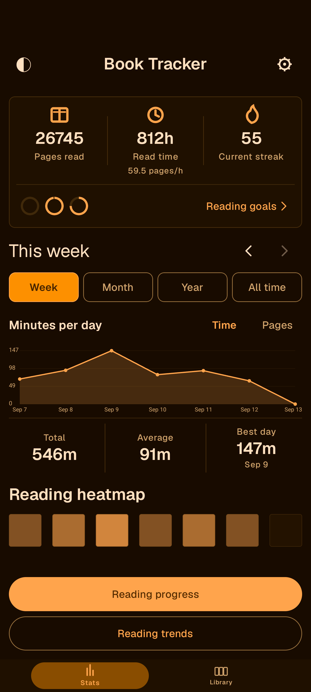
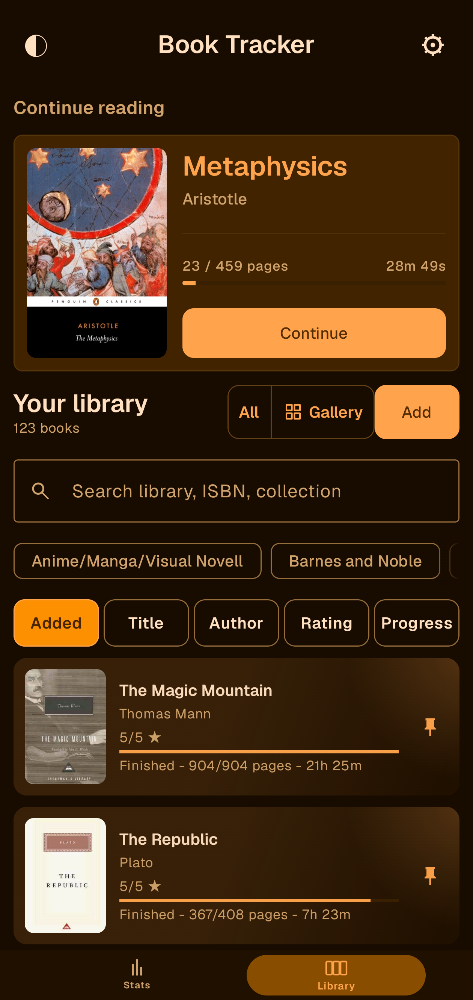
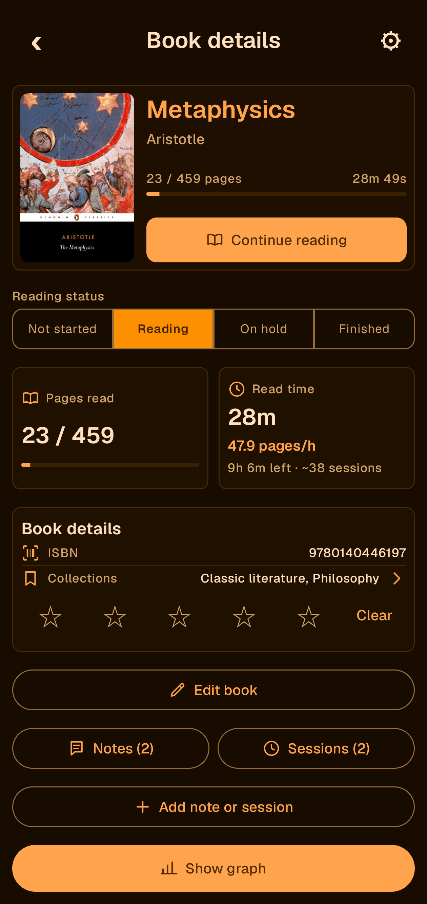
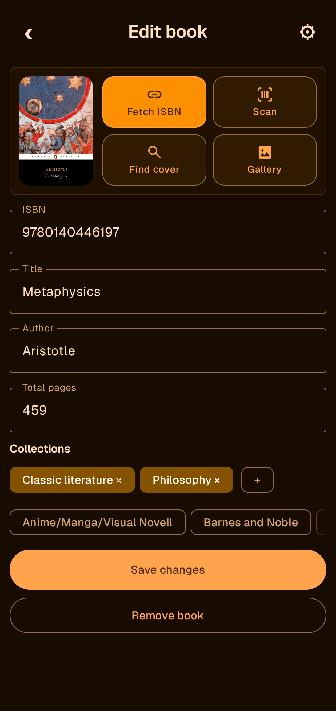
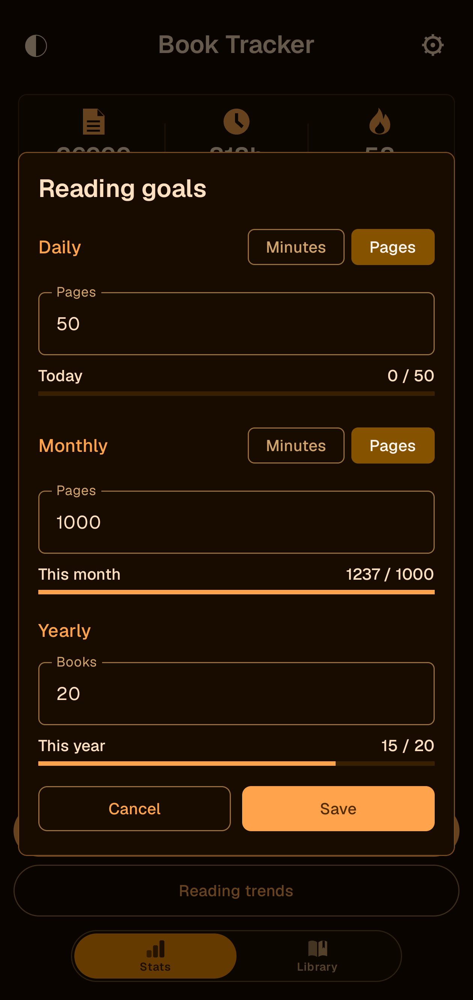
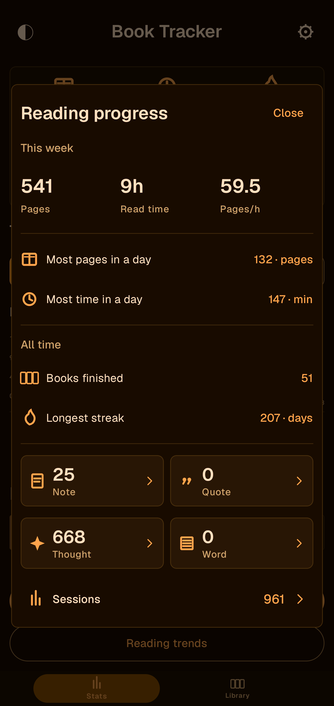
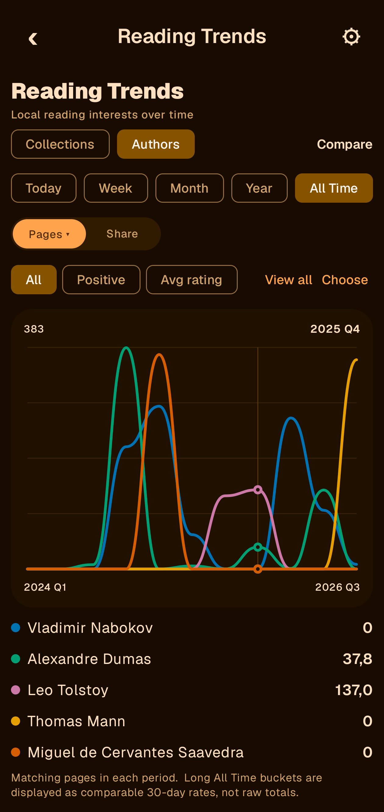
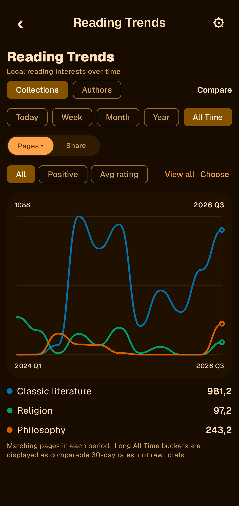
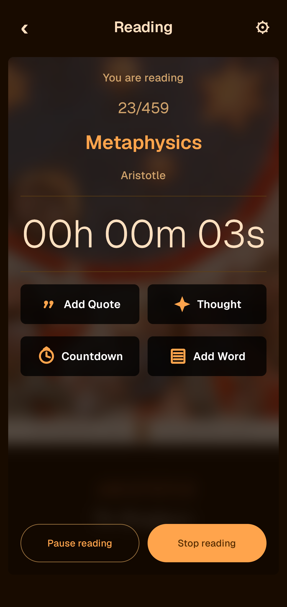

# Book Tracker


An Android reading journal for books, reading sessions, notes and personal goals. Your library is stored locally; no account is required.

## Screenshots

<table>
<tr><th>Stats</th><th>Library</th></tr>
<tr><td></td><td></td></tr>
<tr><th>Book details</th><th>Edit book</th></tr>
<tr><td></td><td></td></tr>
<tr><th>Reading goals</th><th>Reading progress</th></tr>
<tr><td></td><td></td></tr>
<tr><th>Author trends</th><th>Collection trends</th></tr>
<tr><td></td><td></td></tr>
</table>



## Features

- Library list and gallery, collections, pinned books, search and manual reading status.
- Tap an author in Book details to search your entire library for that author.
- Reading timer with pause/resume, manual sessions and durations longer than 24 hours. Continue reading follows your latest session, independent of library filters.
- Swipe left to start reading; swipe right to pin or unpin.
- Automatically saved reading notes, global note search and copying notes in date order.
- Daily and monthly time/page goals, yearly book goals, heatmaps and reading trends.
- Historical sessions can count toward lifetime totals while being excluded from dated statistics.
- ISBN scanning, metadata lookup, cover search and local cover selection.
- Verified JSON backups with preserved original import data.

## Install and update

Download the signed APK from [GitHub Releases](https://github.com/Roinur/Book-Tracker/releases/latest). Android 8.0 (API 26) or later is required; the release targets ARM64 devices.

Install an update over the existing app. **Do not uninstall or clear storage to update.** Android requires the same application ID and signing key. Export a backup in Settings and keep a copy outside the phone.

Version 1.0 uses Android version code 35 so it can update the earlier development releases. The application ID remains `com.roinur.booktracker`.

## Build

Requirements: JDK 17, Android SDK platform 34 and Build Tools 34.0.0. Open this directory in Android Studio and let Gradle resolve dependencies, or configure `ANDROID_HOME` / an ignored `local.properties` file.

```powershell
git clone https://github.com/Roinur/Book-Tracker.git
cd Book-Tracker
.\gradlew.bat :app:assembleDebug
.\gradlew.bat :app:testReleaseUnitTest
```

On macOS/Linux use `bash ./gradlew` instead of `.\gradlew.bat`. The debug app has a separate `.debug` application ID. It does not replace the daily release.

For signed releases, follow [release signing](RELEASE_SIGNING.md), then:

```powershell
.\gradlew.bat :app:assembleRelease
adb install -r app/build/outputs/apk/release/app-release.apk
```

Instrumentation tests use uniquely named temporary databases. With a release signing configuration and an attached test device:

```powershell
.\gradlew.bat :app:connectedReleaseAndroidTest
```

The first build needs internet access. No private export, signing key or local SDK path belongs in this repository.

## Data and privacy

Library records, notes and active-session state are local. Android system backup may also copy app data depending on device settings. Metadata/cover searches contact Open Library or Google Books and send the search terms. Camera barcode processing uses ML Kit; its SDK may send operational metrics to Google. See [privacy](PRIVACY.md).

See [data compatibility](DATA_COMPATIBILITY.md) before changing storage or import code and [architecture](ARCHITECTURE.md) for the source layout.

## Credits and license

Book Tracker grew out of Roinur's Sauce Tracker.

No license is granted for Book Tracker source code. Copyright (c) 2026 Roinur. All rights reserved. Third-party components retain their own licenses; see [third-party notices](THIRD_PARTY_NOTICES.md). Book cover artwork remains the property of its respective rights holders and is not included as sample library data.
